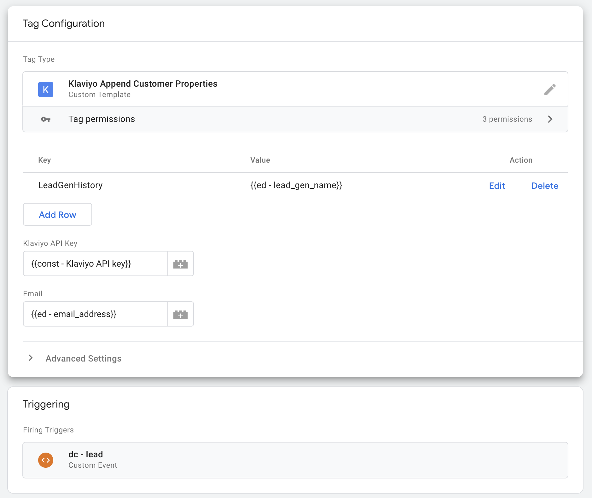

# GTM Server Tag - Append Values to Custom Customer Property Arrays

This tag template can be used to append values to custom customer property arrays, using the email address of the profile. This is useful when the Klaviyo profile ID is not necessarily known. This tag uses the `profile-import` Klaviyo endpoint to update the profile: https://apidocs.klaviyo.com/reference/profiles#update-profile.

## Use Cases

- This could be used to track any array of values for a customer, such as the products they've purchased, the pages they've visited, etc.
- I developed this because we wanted to be able to track which lead generators the customer has used in a custom `LeadGenHistory` property. This way whenever the user returns to our website to submit another lead gen form, it's added to an array, instead of only tracking their initial lead source.

## How to Use

1. Import the tag template to your server side container.
2. Create a new tag using this template.
3. Set the `API Key` field to your Klaviyo API Key. This is most likely already stored in a variable with your implementation.
4. Set the `Email` field to the variable where the email address is stored during the event creation.
5. Add a key/value pair to the `Properties` field for each property you want to append to. The key should be the name of the property, and the value should be the value you want to append. Example: 
6. Add a trigger to the tag that will fire when you want to append the values to the properties. This could be a custom event, a page view, etc.
